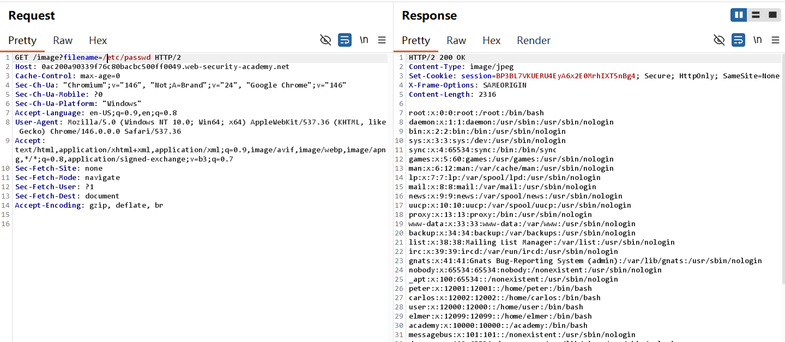
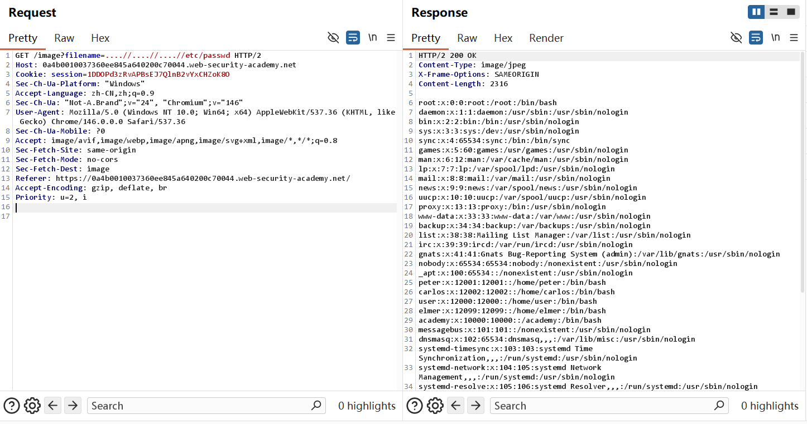
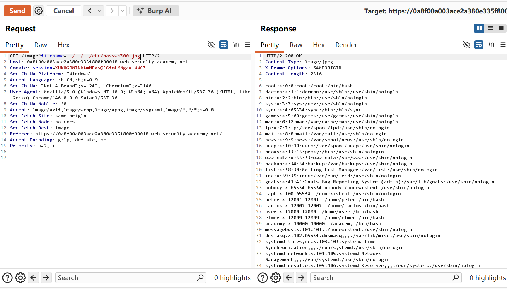

## Path Traversal-Burp 复现

## 实验信息

- 平台：PortSwigger Web Security Academy
- 漏洞：路径遍历漏洞（Path Traversal）
- Lab:  
  1. File path traversal, traversal sequences blocked with absolute path bypass
  2. File path traversal, traversal sequences stripped non-recursively
  3. File path traversal, traversal sequences stripped with superfluous URL-decode 
  4. File path traversal, validation of start of path 
  5. File path traversal, validation of file extension with null byte bypass  
- 难度：practitioner

## 漏洞原理
该漏洞属于Path traversal(路径遍历漏洞)。核心成因是Web应用在读取文件时，将用户可控的参数(如文件名，路径)直接拼接到服务器文件路径中，且未对特殊序列(如../、..\)或绝对路径进行有效过滤。攻击这可以构造恶意参数突破预期的文件目录，读取系统上的任意文件(如/etc/passwd)

## 测试过程

通过sever-side vulnerablites 模块的path traversal中的 ../../../etc/passwd能够通过返回上级目录目录来找到目标目录中的重要信息，但是这种递归方法不是完全有效，比如被WAF拦截。以下是常见的绕过方法
Lab 1: File path traversal, traversal sequences blocked with absolute path bypass 绝对路径绕过

1. 访问任意一张图片(需要在http history顶上的filter中允许图片文件的请求信息)，成功访问
2. 当尝试用../来获取信息会发现"No such file"的提示信息

3. 使用绝对路径/etc/passwd成功访问



Lab 2: File path traversal, traversal sequences stripped non-recursively 非递归
1. 应用程序会非递归地移除../序列(只移除一次，不会重复处理),构造payload....//,当服务器移除中间的 ../后，剩下的../依然构成有效遍历



Lab 3: File path traversal, traversal sequences stripped with superfluous URL-decode 编码

1. 依然按照../../../的基本操作，此时通过URL双重编码（利用Burp suite顶部导航栏view中找到Decode可进行多次Encode）(%25即"%"; %2e即".";%2f即"/")，即可成功绕过WAF,访问成功


Lab 4:  File path traversal, validation of start of path 路径开头
1. var/www/img 是 Linux 网站服务器的静态图片存放目录，是 Web 服务器最经典的默认路径.若将其作为真实目录，../../../即为真实返回上一级指令，成功访问


Lab 5：File path traversal, validation of file extension with null byte bypass 文件扩展名
1. 绕过代码只读取jpg文件，使用空字节%00截断。后端检查看到.png后缀时通过校验，底层C/文件系统API中，%00被视为字符串结束符，实际读取路径为../../../etc/passwd
 


## 利用Payload

```http
/etc/passwd 
....//....//....//etc/passwd
%252e%252e%252f%252e%252e%252f%252e%252e%252fetc/passwd
/var/www/images/../../../etc/passwd
../../../etc/passwd%00.jpg
```


## 个人总结

-  第一， 如何利用这个漏洞？

找到读取文件的功能点(图片、下载等),修改文件名为路径遍历序列。如果被过滤，依次尝试绝对路径，非递归、URL编码、前缀绕过或空字符截断。

-  第二，为什么会产生这个漏洞？

开发者信任用户的输入，直接将参数拼接到文件路径中，1并且只用了简单的黑名单过滤(如删掉../、限制后缀)。Attacker可通过各种编码、变形绕过。根本原因是缺少白名单验证和路径规范化


- 第三，如何修复这个漏洞？

1. **避免用户直接控制路径**：使用索引或者ID映射到服务器上的固定文件名
2. **白名单验证**：仅允许字母数字、点、短横线，拒绝包含/ .. \的输入
3. **路径规范化**：获取用户输入后，与基目录拼接。使用平台规范化API,解析出真实路径，检查规范化后的路径是否以预期的基目录开头。若不是，则拒绝访问。

Java代码示例：

```java
File file = new File(BASE_DIRECTORY, userInput);
if (file.getCanonicalPath().startsWith(BASE_DIRECTORY)) {
    // process file
}
```

